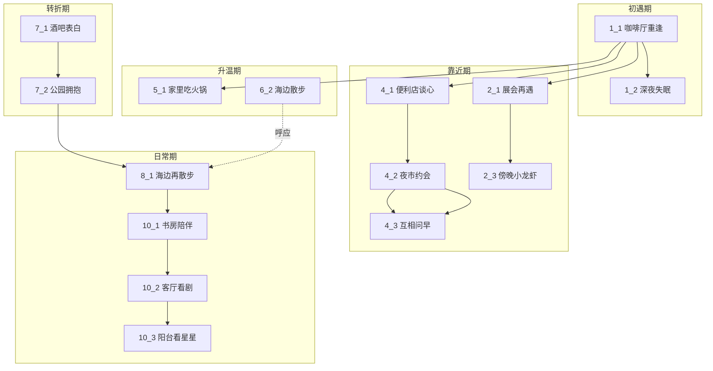
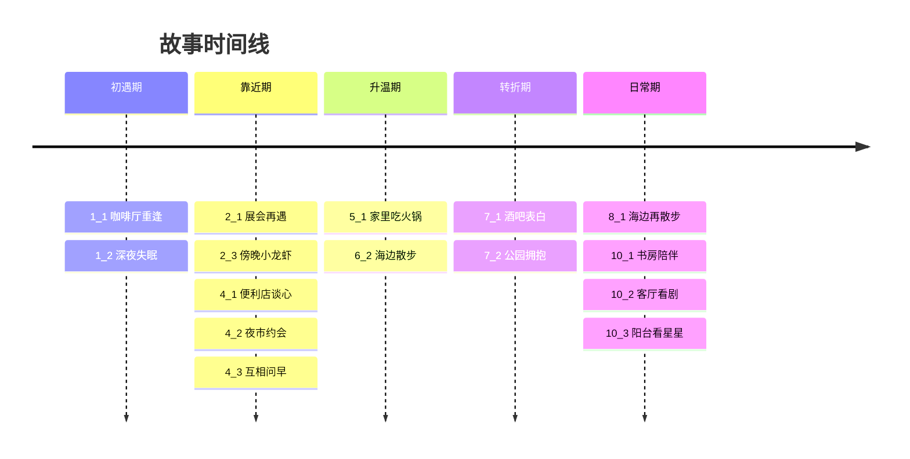

# 场景关系图

## 场景列表

| 编号 | 场景 | 阶段 |
|------|------|------|
| 1_1 | 咖啡厅重逢 | 初遇期 |
| 1_2 | 深夜失眠 | 初遇期 |
| 2_1 | 展会再遇 | 靠近期 |
| 2_3 | 傍晚小龙虾 | 靠近期 |
| 4_1 | 便利店谈心 | 靠近期 |
| 4_2 | 夜市约会 | 靠近期 |
| 4_3 | 互相问早 | 靠近期 |
| 5_1 | 家里吃火锅 | 升温期 |
| 6_2 | 海边散步 | 升温期 |
| 7_1 | 酒吧表白 | 转折期 |
| 7_2 | 公园拥抱 | 转折期 |
| 8_1 | 海边再散步 | 日常期 |
| 10_1 | 书房陪伴 | 日常期 |
| 10_2 | 客厅看剧 | 日常期 |
| 10_3 | 阳台看星星 | 日常期 |

## 关系图

## 时间线

## 跨场景线索

| 线索 | 起始场景 | 经过场景 | 收束场景 |
|------|---------|---------|---------|
| 配角撮合（黎初晓/周喻明） | 1_1 咖啡厅重逢 | 4_2 夜市约会 | 5_1 家里吃火锅 |
| 海边记忆 | 1_1（写信） | 6_2 海边散步 | 8_1 海边再散步 |
| 十年暗恋闪回 | 1_1 / 1_2 | 4_1 / 5_1 / 6_2 | 7_1 酒吧表白 |
| 日常陪伴 | — | — | 10_1→10_2→10_3 |

## 场景间引用关系

| 场景 | 引用了 | 被引用 |
|------|--------|--------|
| 1_1 咖啡厅重逢 | — | 1_2, 4_2, 5_1, 6_2, 8_1 |
| 1_2 深夜失眠 | 1_1 | — |
| 2_1 展会再遇 | 1_1 | 2_3 |
| 2_3 傍晚小龙虾 | 2_1 | — |
| 4_1 便利店谈心 | 2_1 | 4_2 |
| 4_2 夜市约会 | 4_1, 1_1 | 4_3 |
| 4_3 互相问早 | 4_2 | — |
| 5_1 家里吃火锅 | 1_1 | — |
| 6_2 海边散步 | 1_1 | 8_1 |
| 7_1 酒吧表白 | — | 7_2 |
| 7_2 公园拥抱 | 7_1 | 8_1 |
| 8_1 海边再散步 | 6_2, 1_1 | — |
| 10_1 书房陪伴 | — | — |
| 10_2 客厅看剧 | — | — |
| 10_3 阳台看星星 | — | — |
