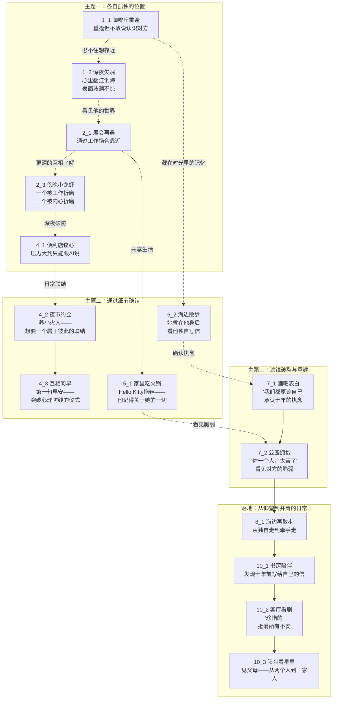
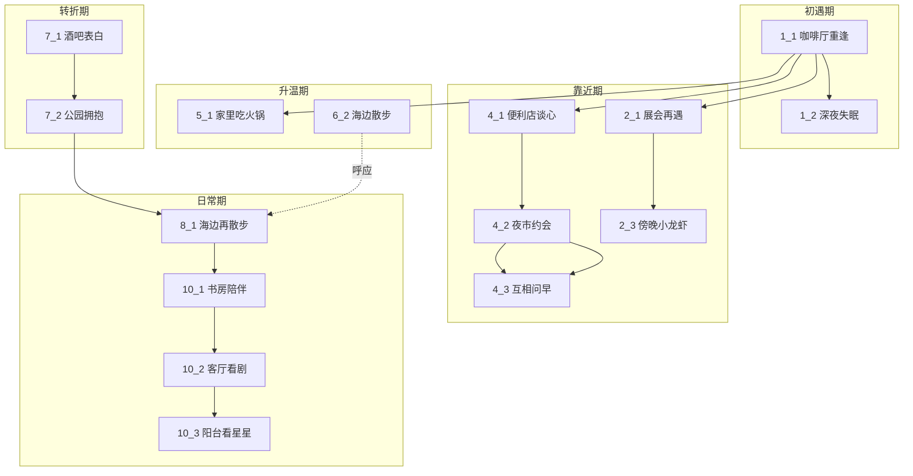
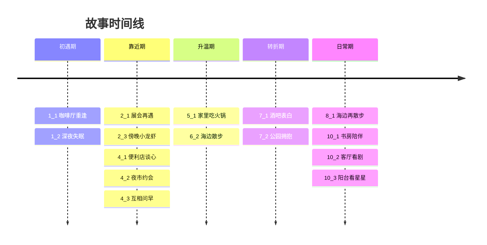
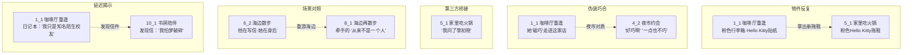

# 场景关系图

## 创作主题

> 两个互相暗恋了十年的人，如何从各自孤独的位置走到一起。

三组主题变奏贯穿所有场景：

| 主题 | 核心问题 | 承载方式 |
|------|---------|---------|
| 各自孤独的位置 | 想靠近但不敢 | 内心戏、身体语言先于语言 |
| 通过细节确认 | 对方是否也在意我 | 日常物件、小动作、仪式 |
| 滤镜破裂与重建 | 知道真实的对方后还喜欢吗 | 看见脆弱、承认执念 |

## 按主题分组

## 按阶段分组

## 时间线

## 跨场景线索

| 线索 | 起始场景 | 经过场景 | 收束场景 |
|------|---------|---------|---------|
| 配角撮合（黎初晓/周喻明） | 1_1 咖啡厅重逢 | 4_2 夜市约会 | 5_1 家里吃火锅 |
| 海边记忆 | 1_1（写信） | 6_2 海边散步 | 8_1 海边再散步 |
| 十年暗恋闪回 | 1_1 / 1_2 | 4_1 / 5_1 / 6_2 | 7_1 酒吧表白 |
| 日常陪伴 | — | — | 10_1→10_2→10_3 |

## 场景间引用关系

| 场景 | 引用了 | 被引用 |
|------|--------|--------|
| 1_1 咖啡厅重逢 | — | 1_2, 4_2, 5_1, 6_2, 8_1 |
| 1_2 深夜失眠 | 1_1 | — |
| 2_1 展会再遇 | 1_1 | 2_3 |
| 2_3 傍晚小龙虾 | 2_1 | — |
| 4_1 便利店谈心 | 2_1 | 4_2 |
| 4_2 夜市约会 | 4_1, 1_1 | 4_3 |
| 4_3 互相问早 | 4_2 | — |
| 5_1 家里吃火锅 | 1_1 | — |
| 6_2 海边散步 | 1_1 | 8_1 |
| 7_1 酒吧表白 | — | 7_2 |
| 7_2 公园拥抱 | 7_1 | 8_1 |
| 8_1 海边再散步 | 6_2, 1_1 | — |
| 10_1 书房陪伴 | — | — |
| 10_2 客厅看剧 | — | — |
| 10_3 阳台看星星 | — | — |

## 场景主题映射

| 场景 | 所属主题 | 情感载体 |
|------|---------|---------|
| 1_1 咖啡厅重逢 | 各自孤独的位置 | 毛巾擦头发——下意识的亲近 |
| 1_2 深夜失眠 | 各自孤独的位置 | 翻来覆去的心跳 |
| 2_1 展会再遇 | 各自孤独的位置 | 王助理的八卦——第三者的眼睛 |
| 2_3 傍晚小龙虾 | 各自孤独的位置 | 各自身陷困局 |
| 4_1 便利店谈心 | 各自孤独的位置 | 捏肩——不忍看对方痛苦 |
| 4_2 夜市约会 | 通过细节确认 | 养小火人——想要联结的仪式 |
| 4_3 互相问早 | 通过细节确认 | 第一句早安——突破防线 |
| 5_1 家里吃火锅 | 通过细节确认 | Hello Kitty拖鞋——他记得一切 |
| 6_2 海边散步 | 通过细节确认 | 她曾在身后看他写信 |
| 7_1 酒吧表白 | 滤镜破裂与重建 | "我们都原谅自己" |
| 7_2 公园拥抱 | 滤镜破裂与重建 | "你一个人，太苦了" |
| 8_1 海边再散步 | 并肩日常 | 从独自走到牵手走 |
| 10_1 书房陪伴 | 并肩日常 | 发现十年前写给自己的信 |
| 10_2 客厅看剧 | 并肩日常 | "珍惜的" |
| 10_3 阳台看星星 | 并肩日常 | 见父母——从两个人到一家人 |

## 引用手法

五种手法用于跨场景引用和信息压缩，核心原则：**不让角色直接说出来，让读者自己把两个场景拼起来。**

| 手法 | 工作方式 | 例子 |
|------|---------|------|
| 物件反复 | 同一物件出现在不同场景，自动携带上下文 | 1_1 行李箱贴纸 → 5_1 Hello Kitty拖鞋 |
| 伪装巧合 | 双方装作不知道，内心知道，读者也知道 | 4_2 "好巧啊"（双方都在试探） |
| 第三方桥接 | 通过配角对话压缩一个完整的未写场景 | 5_1 "我问了黎初晓" |
| 场景对照 | 同一地点、不同时间、不同状态 | 6_2 独自海边 → 8_1 牵手海边 |
| 延迟揭示 | 前期的内心话/秘密在后期被对方发现 | 1_1 日记本 → 10_1 十年信 |

### 场景手法标注

